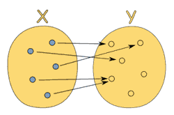
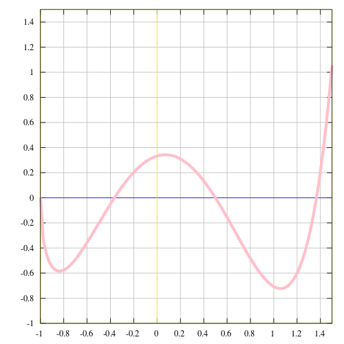

# 03 장: 순수 함수와 순수한 기쁨을

## 한번 더 순수함에 대하여

순수 함수라는 개념을 한번 확실하게 할 필요가 있습니다.

> 순수함수란 부작용(side effed)가 없고 같은 입력에 대해 항상 같은 출력을 반환하는 함수이다.

`slice`와 `splice`를 비교해보죠. 이 둘은 정확하게 같은 기능을 합니다. 하지만 많이 다른 방식으로 작동하지요. 우리는 `slice`가 같은 입력에 대해 항상 같은 출력을 주기 때문에 이 함수를 **순수**하다고 합니다. 하지만 `splice`는 배열을 집어 삼키고 내뱉을 때 그 값을 영원히 바꾸어 관측가능한 효과를 만듭니다.

```js
const xs = [1, 2, 3, 4, 5];

// 순수
xs.slice(0, 3); // [1,2,3]

xs.slice(0, 3); // [1,2,3]

xs.slice(0, 3); // [1,2,3]

// 비순수
xs.splice(0, 3); // [1,2,3]

xs.splice(0, 3); // [4,5]

xs.splice(0, 3); // []
```

함수형 프로그래밍에서는 `splice` 같이 데이터를 **바꾸어** 통제하기 어려운 함수를 싫어합니다. `splice`처럼 뒤죽박죽인 함수가 아니라 매번 똑같은 결과를 신뢰성 있게 반환하는 함수를 만들기 위해 노력하고 있기 때문이죠.

다른 예를 볼까요?

```js
// 비순수
let minimum = 21;
const checkAge = (age) => age >= minimum;

// 순수
const checkAge = (age) => {
  const minimum = 21;
  return age >= minimum;
};
```

순수하지 않은 부분에서 `checkAge`는 결과값을 결정할 때 변하는 값(mutable variable)인 `minimum`에 의존합니다. 다시 말해서, 함수가 시스템의의 상태에 의존하고 이는 외부 환경에 대해 생각해야하는 [인지 부담](https://en.wikipedia.org/wiki/Cognitive_load)을 증가시키는 좋지 않은 결과를 낳습니다..

이 예에서 그렇게 보이지는 않을지도 모르지만 상태에 의존하는 것은 시스템의 복잡성을 높이는 가장 큰 원인 중의 하나입니다(http://curtclifton.net/papers/MoseleyMarks06a.pdf). `checkAge`는 입력이 아니라 외부요소에 의존해서 다른 결과를 반환할 수도 있어요. 이것은 순수성에 위배될 뿐만 아니라 소프트웨어에 대해 생각할 때마다 우리의 머리를 쥐어짜게 만듭니다.

반면, 순수한 형태에서 함수는 완전히 자기 충족적(self sufficient)입니다. 변수 `minimum`가 불변하게 만들기 때문에 순수성을 해치지 않죠. 이렇게 하기 위해서 우리는 객체를 얼려야(freeze)합니다.

```js
const immutableState = Object.freeze({ minimum: 21 });
```

## 부수효과는 ...를 포함할 수 있어요

직관을 향상시키기 위해 "부작용"에 대해 좀 더 들여다봅시다. 그래서 **순수함수**의 정의에 있는, 의심할 여지 없이 사악한 **부수효과**란 무엇인가요? 우리는 계산을 하는 동안 결과를 만들기 위한 것이 아닌 모든 것을 **효과**라고 부를 것입니다.

효과에 내재된 나쁜 것은 없기 때문에 우리는 이후의 장에서 효과를 계속 사용할 것입니다. 부적적인 것이 내포된 것은 **부수** 쪽입니다. 물만있다고 벌레가 자라지는 않습니다. **흐르지 않는** 물이 벌레들을 만들지요. 장담컨대 **부수**효과는 당신의 프로그램에서의 번식지입니다.

> **부수효과**는 계산을 하는 동안 시스템의 상태를 바꾸거나 외부 환경과 **관측 가능한 상호작용**을 하는 것입니다.

부수 효과는 다음과 같은 것이 있습니다.

- 파일 시스템을 바꾸기
- 데이터베이스에 레코드를 삽입하기
- http 호출을 하기
- 변경(mutations)
- 화면에 출력하기 / 로깅
- 유저에게 인풋을 받기
- DOM을 쿼리하기
- 시스템 상태에 접근하기

그리도 이것 말고도 많지요. 함수 밖 세상과 상호작용하는 어떠한 것도 부수효과입니다. 아마 이런 것들 없이 쓸모있는 프로그래을 만들 수 있을 지 의심이 갈거에요. 함수형 프로그래밍의 철학은 부수효과가 잘못된 행동을 야기하는 첫번째 원인이라고 말합니다.

오히려 부수효과를 사용하는 것을 금지하지는 않고 그들을 통제받는 환경에 담아서 실행합니다. 이후에 펑터나 모나드를 다루게 되면서 어떻게 할 수 있는 지 배우게 되겠지만 일단 지금은 이런 음흉한 함수들을 순수한 함수에서 분리하는 것을 연습해봅시다.

부수효과는 함수가 **순수**하지 않게 만듭니다. 정의상 순수 함수는 같은 입력에 대해 같은 출력을 반환하는데 만약 지역적인 함수의 밖과 관련되면 이것을 보장할 수 없다는 것은 일리가 있습니다.

이제 왜 우리가 같은 입력에 같은 출력을 주장하는지 좀 더 자세히 볼까요? 교복을 단정하게 입고 중학교 2학년 수학을 보러 갑시다.

## 중학교 2학년 수학

mathisfun.com 에서:

> 함수는 값 사이의 특별한 관계입니다:
> 각각의 입력은 딱 하나의 출력을 주지요.

다시 말해서, 함수는 단순히 두 값 사이의 관계입니다. 입력과 출력이요. 각각의 입력이 딱 하나의 출력을 가지지만 출력은 각 입력에 대해 유일할 필요는 없어요. 아래 그림은 `x`에서 `y`로 가는 유효한 함수를 보여줍니다.

(https://www.mathsisfun.com/sets/function.html)

반대로, 아래 그림은 입력 `5`를 여러 출력과 연결하기 때문에 함수가 **아닙니다.**

(https://www.mathsisfun.com/sets/function.html)

함수는 (입력, 출력) 쌍으로 이루어진 집합으로 생각할 수도 있어요. `[(1,2), (3,6), (5,10)]` (이 함수는 입력을 두배하네요)

아니면 표로 나타낼 수도 있죠.

<table> <tr> <th>입력</th> <th>출력</th> </tr> <tr> <td>1</td> <td>2</td> </tr> <tr> <td>2</td> <td>4</td> </tr> <tr> <td>3</td> <td>6</td> </tr> </table>

또는 `x`를 입력, `y`를 출력으로 하는 그래프로도 나타낼 수 있어요.



상세한 구현이 없어도 입력이 출력을 가르키기만 한다면 됩니다. 함수는 그저 입력과 출력 사이의 단순한 매핑이기 때문에 객체 리터럴로 적고 `()`대신 `[]`로 실행할 수도 있지요

```js
const toLowerCase = {
  A: "a",
  B: "b",
  C: "c",
  D: "d",
  E: "e",
  F: "f",
};
toLowerCase["C"]; // 'c'

const isPrime = {
  1: false,
  2: true,
  3: true,
  4: false,
  5: true,
  6: false,
};
isPrime[3]; // true
```

당연하겠지만 당신은 손으로 적는 대신 계산을 하고 싶을 수도 있어요. 하지만 이건 함수를 보는 또 다른 관점입니다. ("인자가 여러개인 함수는 어떻하나요"라는 질문이 생길 수도 있어요. 사실 이 경우를 수학적인 언어로 생각하는 것은 조금 불편해요. 지금은 입력들을 하나의 배열이나 그냥 `arguments` 객체로 생각하세요. **커링**에 대해 배울 때 함수의 수학적인 정의를 바로 모델링할 수 있을 거에요.)

한가지 극적인 폭로를 하자면, 순수 함수는 수학적인 함수이고 이것이 함수형 프로그래밍의 모든 것이에요. 이 작은 천사들로 프로그래밍을 하는 것은 많은 장점이 있습니다. 이제 왜 우리가 순수성을 지키기 위한 기나긴 여정을 떠나려고 하는지에 대한 이유를 살펴볼까요?

## 순수성의 예

### 캐시 가능함

처음 온 분들을 위해, 순수 함수는 언제나 입력으로 캐시를 할 수 있어요. 이것은 보통 memoization라는 기술을 사용해서 구현하지요.

```js
const squareNumber = memoize((x) => x * x);

squareNumber(4); // 16

squareNumber(4); // 16, returns cache for input 4

squareNumber(5); // 25

squareNumber(5); // 25, returns cache for input 5
```

여기 단순화된 구현이 있어요. 이것 말고도 좀 더 견고한 버전의 구현들도 많이 있습니다.

```js
const memoize = (f) => {
  const cache = {};

  return (...args) => {
    const argStr = JSON.stringify(args);
    cache[argStr] = cache[argStr] || f(...args);
    return cache[argStr];
  };
};
```

계산을 미룸으로써 비순수 함수를 순수함수로 바꿀 수 있다는 것을 주목할만 합니다.

```js
const pureHttpCall = memoize((url, params) => () => $.getJSON(url, params));
```

재밌는 점은 여기서 실제로 http 호출을 하는 것은 아니라는 거에요. 대신 호출되었을 때 호출을 하는 함수를 반환하지요. `pureHttpCall` 함수는 같은 입력에 대해 항상 같은 출력을 반환하기 때문에 순수합니다. 주어진 `url`과 `params`에 대해 http 호출을 하는 함수를 반환하니까요.

`memoize` 함수는 http 호출의 결과를 캐시하는 대신 생성된 함수를 캐시하지만 잘 작동하긴 합니다.

지금은 그다지 유용하지 않지만 곧 이것을 유용하게 사용하게 해주는 몇가지 트릭을 배울거에요. 중요한 점은 아무리 파괴적으로 보여도 모든 함수를 캐싱할 수 있다는 것입니다.

### 휴대성 / 자기 문서화

순수 함수는 완전히 자급자족합니다. 함수가 필요로하는 모든 것은 은쟁반 위에 담겨서 함수에게 전해지지요. 잠깐 고민해볼까요... 어떻게 이게 장점이 될까요? 함수의 의존성이 명시하면 코드를 처음 보는 사람들이 함수를 쉽게 이해할 수 있습니다. - 그 아래에서 어떠한 이상한 일도 일어나지 않아요.

```js
// impure
const signUp = (attrs) => {
  const user = saveUser(attrs);
  welcomeUser(user);
};

// pure
const signUp = (Db, Email, attrs) => () => {
  const user = saveUser(Db, attrs);
  welcomeUser(Email, user);
};
```

이 예에서는 순수함수는 의존성에 대해 정직하게 말고 있고 자신이 무엇을 하는지 정확히 말해줍니다. 함수의 타입만으로도 이 함수가 `Db`와 `Email`, `attrs`를 사용한다는 것을 알 수 있어요.

우리는 단순히 계산을 미루지 않고 함수를 순수하게 만드는 법을 배울것이지만 요점은 순수한 형태가 음흉한 비순수한 형태보다 정보를 더 많이 준다는 것을 명확히 해야합니다.

또 우리는 의존성을 인자를 통해 "주입"하거나 넘겨주는것을 강요받고 있다는 점도 주목할만 합니다. 이것은 데이터베이스나 메일 클라이언트, 아니면 나머지 당신이 가진 것을 파라미터화함으로써 프로그램을 더 유연하게 만들어주지요(걱정하지는 마세요, 들리는 것보다 좀 더 쉽게 하는 방법을 곧 배울거에요). 만약 다른 Db를 사용해야 한다면 우리는 그저 그 Db로 함수를 호출하면 됩니다. 또 새 어플리케이션에서 이 신뢰할 수 있는 함수를 재사용하고 싶다면 그저 그 때 사용하고 있는 `Db`나 `Email`을 주면 됩니다.

자바스크립트 환경에서 휴대성이란 함수를 직렬화하고 소켓을 통해 보내는 것을 의미할 수도 있어요. 또는 우리의 모든 앱 코드를 웹워커에서 돌리는 것을 의미할 수도 있지요. 휴대성은 매우 강력한 특징입니다.

명령형 프로그램의 "일반적인" 메소드와 프로시져는 상태, 의존성, 사용가능한 효과를 통해 바깥 환경과 밀접하게 연관되어 있지만 순수함수는 우리가 원하는 곳 어디서든 실행할 수 있어요.

언제 마지막으로 메소드를 새 프로그램으로 복사했었나요? 얼랭(Erlang)의 제작자인 Jow Armstrong이 한 말을 저는 좋아합니다. "객체지향 언어의 문제점은 그들이 그들 주위에 있는 모든 암시적인 환경을 가지고 있다는 점입니다. 당신은 바나나를 원했지만 바나나를 들고있는 고릴라를 얻게 됩니다. 그리고 정글 전체도요.."

### 테스트 가능함

다음으로 순수함수가 테스트를 훨씬 쉽게 만들어준다는 것을 알 수 있을 거에요. "실제" 결제 게이트웨이를 모킹하거나 매번 외부 환경의 상태를 설정한 후 테스트를 실행하면서 세계의 상태를 검사 할 필요가 없어요. 그저 함수에게 입력을 주고 결과물을 확인하면 됩니다.

사실, 함수형 커퓨니티에서는 입력을 자동으로 만들고 출력이 갖출 속성에 대해 설정하는 새로운 테스트 도구를 개척하고 있습니다. 이 책의 범위를 벗어나지만 **Quickcheck**라는 툴을 한번 찾아보고 시도해 보는 것을 권장합니다. 이 툴은 순수한 함수 환경을 위해 제작되었어요.

### 합리성

많은 사람들이 순수 함수와 함께 할 때 얻는 가장 큰 이득이 **참조 투명성**이라고 믿습니다. 어떤 코드 조각이 프로그램 행동에 변경 없이 그것의 평가결과와 대체할 수 있을 때 그것을 참조 투명하다고 말합니다.

순수함수는 부작용을 가지지 않기 때문에 결과물을 통해서만 프로그램의 행동에 영향을 줄 수 있어요. 더욱이, 결과값은 입력된 값에만 의존하기 때문에 순수 함수는 언제나 참조 투명성을 지닙니다. 한번 예를 볼까요?

```js
const { Map } = require("immutable");

// Aliases: p = player, a = attacker, t = target
const jobe = Map({ name: "Jobe", hp: 20, team: "red" });
const michael = Map({ name: "Michael", hp: 20, team: "green" });
const decrementHP = (p) => p.set("hp", p.get("hp") - 1);
const isSameTeam = (p1, p2) => p1.get("team") === p2.get("team");
const punch = (a, t) => (isSameTeam(a, t) ? t : decrementHP(t));

punch(jobe, michael); // Map({name:'Michael', hp:19, team: 'green'})
```

`decrementHP`와 `isSameTeam`, `punch`는 모두 순수하고 따라서 참조 투명합니다. 이제 **equational reasoning**이란 기술을 사용할 수 있어요. 이것은 코드를 보면서 "같은 것을 같은 것으로" 치환하는 방법을 말해요. 프로그램의 이상한 계산을 염두하지 않고 손수 코드를 계산하는 것과 약간 비슷합니다. 이 코드에 참조 투명성을 적용해볼까요?
`decrementHP`, `isSameTeam` and `punch` are all pure and therefore referentially transparent. We can use a technique called _equational reasoning_ wherein one substitutes "equals for equals" to reason about code. It's a bit like manually evaluating the code without taking into account the quirks of programmatic evaluation. Using referential transparency, let's play with this code a bit.

먼저, `isSameTeam` 함수를 인라인시켜 봅시다.

```js
const punch = (a, t) => (a.get("team") === t.get("team") ? t : decrementHP(t));
```

우리 데이터는 불변하기 때문에 그냥 팀들 그들의 실제 값으로 바꿀 수 있어요.

```js
const punch = (a, t) => ("red" === "green" ? t : decrementHP(t));
```

그리고 비교분의 결과가 거짓이라는 것도 알 수 있기 때문에 전체 if 분기를 제거할 수 있어요.

```js
const punch = (a, t) => decrementHP(t);
```

`decrementHP`를 한번 더 인라인화 하면 이 상황에서 punch는 `hp`를 1 깎는 호출이 됩니다.

```js
const punch = (a, t) => t.set("hp", t.get("hp") - 1);
```

이런식으로 코드를 다룰 수 있는 것은 일반적인 리팩토링을 하거나 코드를 이해할 때 큰 도움이 됩니다. 사실 우리는 갈매기 무리 프로그램을 리팩토링 할 때 이 방법을 사용했었어요. 덧셈과 곱셈에 마구(harness)를 채울 때 equational reasoning을 사용했지요. 또 우리는 이 기술을 이 책에 걸쳐서 사용하게 될 거에요.

### 병렬 코드

마침내, 마지막 일격입니다. 우리는 순수함수라면 무엇이든 병렬적으로 실행할 수 있어요. 순수함수는 공유 메모리에 접근할 필요가 없고 부수효과가 없기 때문에 부수효과때문에 생기는 race condition이 없기 때문이죠.

이것은 쓰레드를 사용하는 서버 사이드 js 환경과 웹 워커를 사용하는 브라우저 모두 가능합니다. 비록 현재의 개발 문화는 비순수 함수를 다루는 복잡성을 피하기 위해 이것을 피하지만요.

## 요약

우리는 순수 함수가 무엇인지, 그리고 왜 함수형 프로그래머로써 우리가 그들이 아주 멋지다고(cat's evening wear) 믿는지 봤습니다. 지금부터 우리는 모든 함수들을 순수한 방법으로 적으려고 애를 쓸 것입니다. 우리는 우리를 도와줄 몇가지 도구들을 더 필요하지만 순수하지 않은 함수을 나머지 순수한 코드와 격리시키려고 노력할 것입니다.

추가적인 도구 없이 순수 함수로 프로그램을 만드는 것은 좀 귀찮아요. 모든 인자들을 한꺼번에 넘겨주면서 데이터를 저글링해야하고요, 효과는 말할 것도 없이 상태 조차도 사용할 수 없어요. 어떻게 이런 마조히스틱 프로그램을 만들 수 있을까요? 이제 새로운 도구인 커링을 볼 준비가 되셨나요?

[04 장: 커링](ch04-kr.md)
